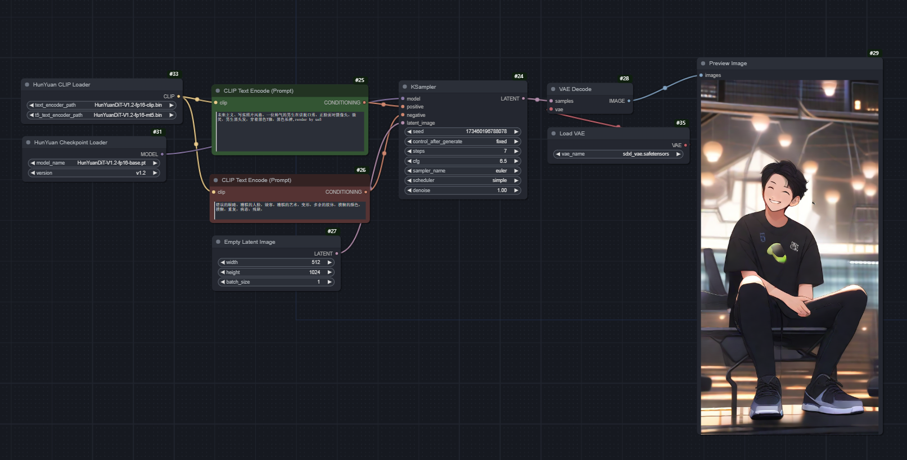

# comfyui-hydit
The ComfyUI code is under Test


## Overview


### Basic Workflow
[](./workflow/hydit-basic-workflow.json)


## Usage
### Installation

manually install, simply clone the repo into the custom_nodes directory with this command:

```
cd ComfyUI/custom_nodes

git clone https://github.com/shadowcz007/comfyui-hydit-lowvram.git

```

Install the requirements:

run directly:

```
cd ComfyUI/custom_nodes/comfyui-hydit-lowvram
install.bat
```

or install the requirements using:

```
../../../python_embeded/python.exe -s -m pip install -r requirements.txt
```

If you are using a venv, make sure you have it activated before installation and use:

```
pip3 install -r requirements.txt
```


### Standard workflow (Recommended)

1. Preparing Model Weights [HunYuanDiT-V1.2-fp16]

Use the command below to download the file to the specified folder. If already downloaded, create a symbolic link to that folder.

[clip_text_encoder](https://huggingface.co/bdsqlsz/HunYuanDiT-V1.2-fp16-pruned/blob/main/clip/pytorch_model.bin) move to ```/models/clip```


[t5](https://huggingface.co/bdsqlsz/HunYuanDiT-V1.2-fp16-pruned/blob/main/mt5/pytorch_model.bin) move to ```/models/t5```


[base model](https://huggingface.co/bdsqlsz/HunYuanDiT-V1.2-fp16-pruned/blob/main/denoiser/pytorch_model_module.pt)  move to ```/models/checkpoints```

<!-- 
2. Preparing LoRa Weights

```shell
# Put LoRa weights trained by Kohya in ComfyUI/models/loras
cp ${HunyuanDiT}/kohya_ss/outputs/last-step{xxxx}.safetensors ${ComfyUI}/models/loras

# (Optional) Put LoRa weights trained by official scripts in ComfyUI/models/loras
python convert_hunyuan_to_coimfyui_lora.py \
      --lora_path ${HunyuanDiT}/log_EXP/001-lora_porcelain_ema_rank64/checkpoints/0000100.pt/adapter_model.safetensors \
      --save_lora_path ${ComfyUI}/models/loras/adapter_model_convert.safetensors

# update the `lora.py` file
cp ${ComfyUI}/custom_nodes/comfyui-hydit/lora.py ${ComfyUI}/comfy/lora.py
``` -->
